# Sprint 2

## Links úteis
 
 

## Entregas

| ID | Tipo | Descrição | Prioridade | Status | Responsável | Pontuação total |
|--|--|--|--|--|--|--|
| [01](#rf-01) | RF | As páginas devem possuir um mecanismo de navegação comum (menu de navegação) que, ao ser clicado, remete o usuário à seção correspondente; | Baixa | ✅ Concluído | Marcos | 6 |
| [02](#rf-02) | RF | O usuário deve ser capaz de se auto cadastrar, informando seu nome completo, e-mail e senha;| Baixa | ✅ Concluído | Lucas | 6 |
| [03](#rf-03) | RF | O usuário deve ser capaz de efetuar autenticação utilizando e-mail do cadastro e senha; | Lucas | ✅ Concluído | Nome | 6 |
| [05](#rf-05) | RF | Aos usuários logados, o sistema deve exibir 3 questões para cada tópico. As questões devem contemplar o tema abordado no tópico;| Média | ✅ Concluído | Vinícius | 15 |
| [06](#rf-06) | RF | O usuário não logado pode acessar o conteúdo das páginas (tópicos) do curso, mas não pode visualizar as questões; | Alta | ✅ Concluído | Ariel, Christopher, Mário e Yan | 32 |
| [09](#rf-09) | RF   | O sistema deve ser capaz de emitir o certificado de conclusão para os usuários que foram aprovados em todos os tópicos; | Baixa | ✅ Concluído | Christopher | 5 |

## Burndown:
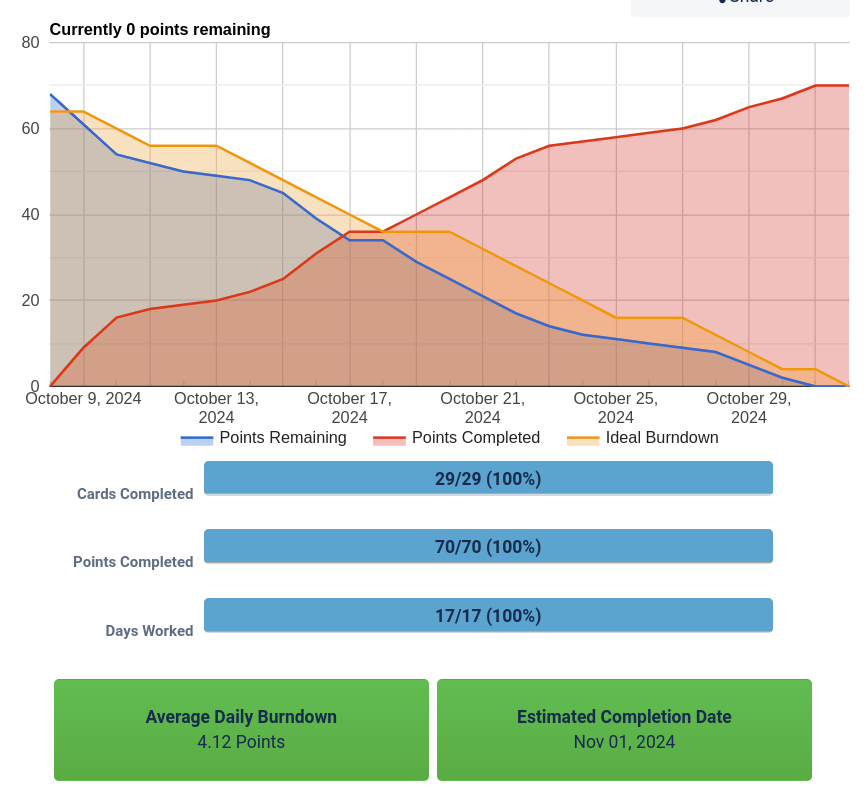
> Atualizado em 17/10/2024

# Backlog - Sprint 2
## Requisito, Histórias de Usuário, DoD e Tarefas 
- A sprint tem uma pontuação total de 70 pontos.

## Diagrama de Caso de Uso do Sistema
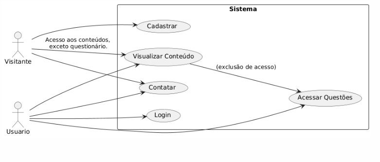
> Diagrama de Caso de Uso - Sistema

## 01 - Requisito Funcional
- As páginas devem possuir um mecanismo de navegação comum (menu de navegação) que, ao ser clicado, remete o usuário à seção correspondente.

### **Diagramas de Caso de Uso:**

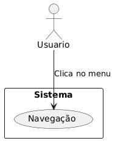
> Diagrama de Caso de Uso - Requisito Funcional 01

> Diagrama de Caso de Uso - Visitante

> Diagrama de Caso de Uso - Usuário Logado

### **Histórias de Usuário:**
- **Como** um visitante do site, **eu quero** um menu de fácil de navegação, entendimento, acessibilidade, **para que** eu possa acessar os conteúdos de forma rápida.

### **DoD - Definition of Done:**
- Existência de menu fixo na página com links para as respectivas páginas sobre scrum.

### **Base:**
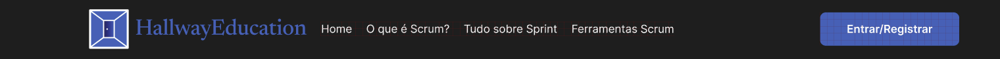
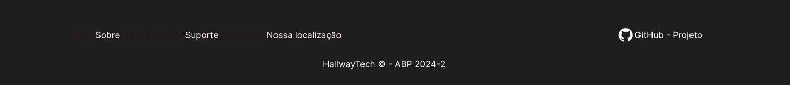

### **Tarefas:**
1. Criar o HTML do menu fixo, com base no Figma.
    - **Estimativa:** 2
    - **Pontuação:** 2
    - **Responsável:** Marcos.
    - **Descrição:** Criar HTML do menu e rodapé, com base no Figma.
    - [Link da Tarefa - Menu](https://trello.com/c/0Z7c6wYO)
    - [Link da Tarefa - Rodapé](https://trello.com/c/4mYkfVpV)
2. Criar o CSS do menu fixo, com base no Figma.
    - **Estimativa:** 3
    - **Pontuação:** 3
    - **Responsável:** Ariel e Marcos
    - **Descrição:** Criar CSS do menu e rodapé, com base no Figma.
    - [Link da Tarefa - Menu](https://trello.com/c/2Z08aGrf)
    - [Link da Tarefa - Rodapé](https://trello.com/c/UeDXojue)

___________________________________________

## 02 - Requisito Funcional
- O usuário deve ser capaz de se auto cadastrar, informando seu nome completo, e-mail e senha.

### **Diagramas de Caso de Uso:**

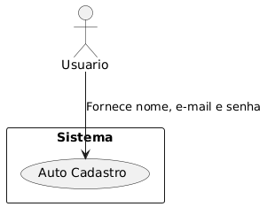
> Diagrama de Caso de Uso - Requisito Funcional 02

### **Histórias de Usuário**
- **Como** um visitante do site, **eu quero** me cadastrar com meu nome completo, e-mail e senha, **para que** eu possa ter acesso a certas funcionalidades.

### **DoD - Definition of Done**
- Tela de registro intuitiva.
- Validação dos campos de nome completo, e-mail e senha.
- Senhas armazenadas em hash seguro (bcrypt, Argon2, etc.).
- Registro do usuário no sistema e o redirecionamento/atualização da página com o login.

### **Base**:
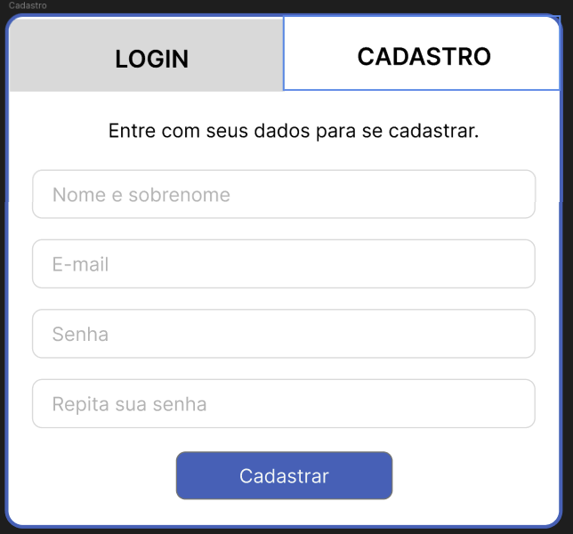

### **Tarefas:**
1. Criar o HTML do Cadastro/Registro, com base no Figma.
    - **Estimativa:** 2
    - **Pontuação:** 2
    - **Responsável:** Lucas.
    - **Descrição:** Criar o respectivo HTML e subir no GitHub.
2. Criar o CSS do Cadastro/Registro, com base no Figma.
    - **Estimativa:** 3
    - **Pontuação:** 3
    - **Responsável:** Lucas
    - **Descrição:** Criar o respectivo CSS, e JS (se houver) e subir no GitHub.
___________________________________________

## 03 - Requisito Funcional
- O usuário deve ser capaz de efetuar autenticação utilizando e-mail do cadastro e senha;

### **Diagramas de Caso de Uso:**

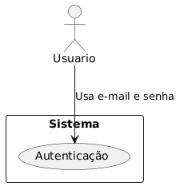
> Diagrama de Caso de Uso - Requisito Funcional 03

### **Histórias de Usuário:**
**Como um** visitante do site/usuário não logado, **eu quero** fazer o login com meu e-mail e senha, **para que** eu possa ter acesso a certas funcionalidades.

### **DoD - Definition of Done**
- Tela de registro simples e intuitiva.
- Validação dos campos de e-mail e senha.

### **Base**:
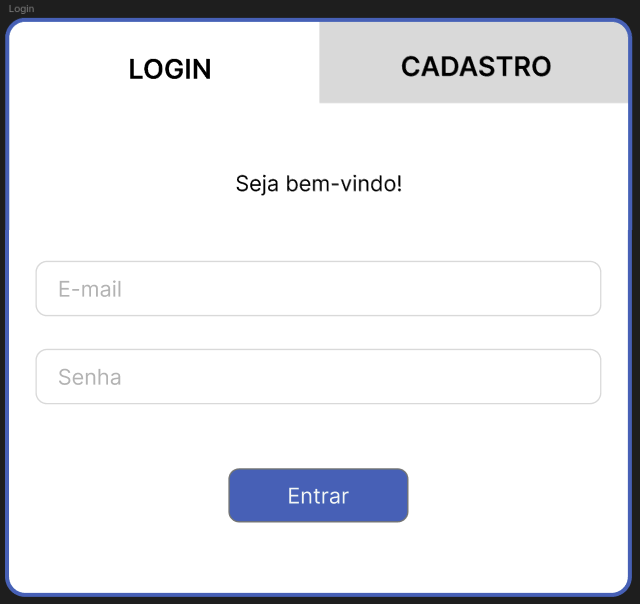

### **Tarefas:**
1. Criar o HTML do Login, com base no Figma.
    - **Estimativa:** 2
    - **Pontuação:** 2
    - **Responsável:** Lucas.
    - **Descrição:** Criar o respectivo HTML e subir no GitHub.
2. Criar o CSS do Login, com base no Figma.
    - **Estimativa:** 3
    - **Pontuação:** 3
    - **Responsável:** Lucas.
    - **Descrição:** Criar o respectivo CSS, JS (se houver), e subir no GitHub.

___________________________________________

## 05 - Requisito Funcional
- Aos usuários logados, o sistema deve exibir 3 questões para cada tópico. As questões devem contemplar o tema abordado no tópico.

### **Diagramas de Caso de Uso:**

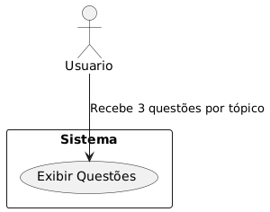
> Diagrama de Caso de Uso - Requisito Funcional 05

### **Histórias de Usuário**
- **Como um** usuário logado, **eu quero** que o sistema me apresente três questões por tópico, **para que** eu possa ter uma avaliação justa do meu conhecimento.
### **DoD - Definition of Done**
- Section intuitiva e simples na página de conteúdo, como um quizz, para o usuário responder as questões do respectivo tópico **OU** - Página intuitiva e simples destinada ao questionário, onde o usuário deverá responder todas as questões.
- Quizz deve aparecer apenas para usuários logados.
- Mecanismo para apresentar questões aleatoriamente aos usuários, categorizado por tópico.

### **Base**:
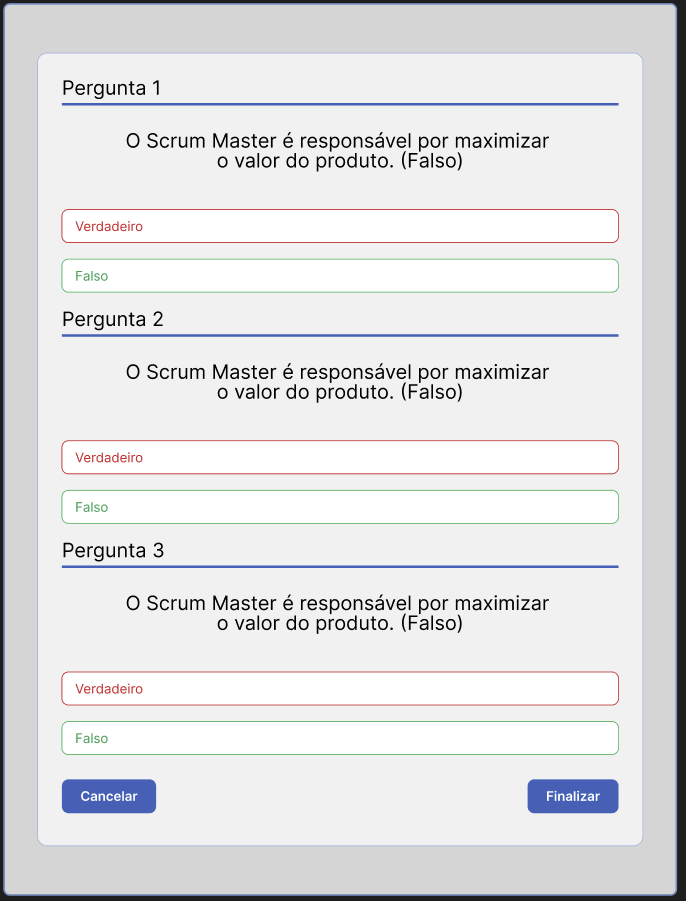

### **Tarefas:**
**1, 2 e 3**. Criar o HTML do Questionário do [Módulo 1 ✅](https://trello.com/c/rFTWGUAO), [Módulo 2 ✅](https://trello.com/c/tVUt2PJT) e [Módulo 3 ✅](https://trello.com/c/Y2dQZ5lq), com base no Figma.
    - **Estimativa:** 6 (2 cada)
    - **Pontuação:** 6 (2 cada)
    - **Responsável:** Vinícius
    - **Descrição:** Criar o respectivo HTML e subir no GitHub.

**4, 5 e 6**. Criar o CSS do Questionário do [Módulo 1 🔨](https://trello.com/c/GpEA7caF), [Módulo 2 🔨](https://trello.com/c/pnUGfaRD) e [Módulo 3 🔨](https://trello.com/c/d4IB6lRn), com base no Figma.
    - **Estimativa:** 9 (3 cada)
    - **Pontuação:** 9 (3 cada)
    - **Responsável:** Vinícius
    - **Descrição:** Criar o respectivo CSS, js (se houver), e subir no GitHub.
___________________________________________

## 06 - Requisito Funcional
- O usuário não logado pode acessar o conteúdo das páginas (tópicos) do curso, mas não pode visualizar as questões;

### **Diagramas de Caso de Uso:**

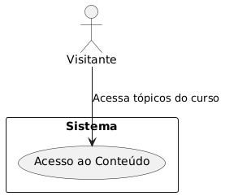
> Diagrama de Caso de Uso - Requisito Funcional 06

### **Histórias de Usuário:**

- **Como** um visitante, **eu quero** ter acesso ao conteúdo do curso, **mas não quero** ter acesso às questões antes de me cadastrar ou logar.

### **Definition of Done:**
- As páginas de conteúdo dos tópicos são visíveis para todos os usuários.
- O site deve ter telas específicas para o ensinamento do Scrum.
- O site deve possuir um menu fixo no topo (navbar), com os links para os respectivos conteúdos/páginas, exemplo: O que é Scrum, Ferramentas, etc.
- **RNF 02 -** As páginas devem ser organizadas em uma sequência lógica para o aprendizado do Scrum com um mecanismo para o usuário navegar para a próxima página e página anterior;
- **RNF 03** - O curso deve cobrir os conhecimentos necessários para o aprendizado do Scrum.
- **RNF 04** - O curso deve seguir uma sequência lógica necessária para o aprendizado do Scrum.
- O quizz não aparece para usuários não logados.

### **Tarefas:**
1. Criar CSS Global para ser utilizado nas páginas.
    - **Estimativa:** 3
    - **Pontuação:** 3
    - **Responsável:** Christopher C.
    - **Descrição:** A ideia do CSS Global é facilitar o desenvolvimento das páginas, nele deve estar especificado a fonte utilizada, cores, definição dos estilos de botões, etc.

2. Criar o HTML da Home, Módulo 1, 2 e 3, com base no Figma.
    - **Estimativa:** 8 (2 cada)
    - **Pontuação:** 8 (2 cada)
    - **Responsável:** Módulo 1 - Ariel, Módulo 2 - Yan, Módulo 3 - Mário
    - **Descrição:** Criar HTML de cada página acima e subir no GitHub.

3. Criar o CSS da Home, Módulo 1, 2 e 3, com base no Figma.
    - **Estimativa:** 12 (3 cada)
    - **Pontuação:** 12 (3 cada)
    - **Responsável:** Módulo 1 - Ariel, Módulo 2 - Yan, Módulo 3 - Mário, Home e Certificado - Christopher
    - **Descrição:** Criar o CSS e JS (se houver), das respectivas páginas e subir no GitHub.

4. Criar imagens por IA ou pesquisar magens para colocar no Módulo 3.
    - **Estimativa:** 2
    - **Pontuação:** 2
    - **Responsável:** Ariel e Mário.
    - **Descrição:** As imagens devem ser colocadas no módulo 3, seguindo pedido do cliente.

5. Utilizar as imagens da tarefa 3 e colocá-las no Módulo 3.
    - **Estimativa:** 2
    - **Pontuação:** 2
    - **Responsável:** Ariel e Mário.
    - **Descrição:** Colocar as imagens no módulo 3 no Figma e no HTML.

___________________________________________

### **Diagramas de Caso de Uso:**

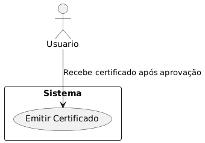
> Diagrama de Caso de Uso - Requisito Funcional 09

## 09 - Requisito Funcional
- O sistema deve ser capaz de emitir o certificado de conclusão para os usuários que foram aprovados em todos os tópicos;

### **Histórias de Usuário**
- **Como um** usuário, **eu quero** receber um certificado ao concluir todos os tópicos do curso, **para que** eu possa comprovar meu conhecimento.

### **DoD - Definition of Done**
- O sistema deve gerar um certificado em PDF com os dados do usuário e a data de conclusão.

### **Base**:

### **Tarefas:**
1. Criar o HTML do Certificado, com base no Figma.
    - **Estimativa:** 2
    - **Pontuação:** 2
    - **Responsável:** Christopher.
    - **Descrição:** Criar HTML da página de certificado e subir no Git.
2. Criar o CSS do Certificado, com base no Figma.
    - **Estimativa:** 3
    - **Pontuação:** 3
    - **Responsável:** Christopher.
    - **Descrição:** Criar o CSS da página de certificado, se necessário, também o JS, e subir no GitHub.