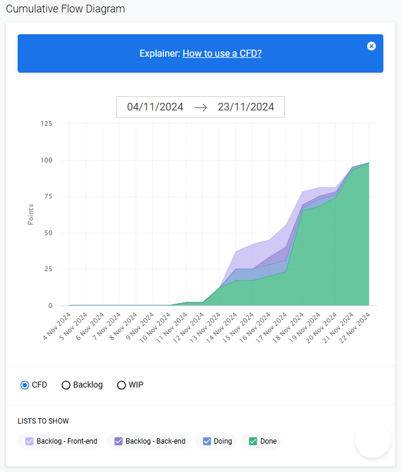

# Sprint 3

## Links úteis
 
 

## Entregas

| ID | Tipo | Descrição | Prioridade | Status | Responsável | Pontuação total |
|--|--|--|--|--|--|--|
| [01](#rf-01) | RF | As páginas devem possuir um mecanismo de navegação comum (menu de navegação) que, ao ser clicado, remete o usuário à seção correspondente; | Baixa | Concluido | Christopher | 6 |
| [02](#rf-02) | RF | O usuário deve ser capaz de se auto cadastrar, informando seu nome completo, e-mail e senha;| Baixa | Concluido | Ariel, Marcos, Vinicius | 6 |
| [03](#rf-03) | RF | O usuário deve ser capaz de efetuar autenticação utilizando e-mail do cadastro e senha; | Baixa | Concluido | Ariel, Vinicius | 6 |
| [05](#rf-05) | RF | Aos usuários logados, o sistema deve exibir 3 questões para cada tópico. As questões devem contemplar o tema abordado no tópico;| Média | Concluido | Lucas, Vinicius | 10 |
| [06](#rf-06) | RF | O usuário não logado pode acessar o conteúdo das páginas (tópicos) do curso, mas não pode visualizar as questões; | Alta | Concluido | Christopher, Mário | 27 |
| [08](#rf-08) | RF | O sistema deve exibir as questões somente nos tópicos que o usuário não tenha sido aprovado. Para ser considerado aprovado no tópico é necessário acertar pelo menos 2 questões; | Alta | Concluido | Lucas, Mário | 5
| [09](#rf-09) | RF | O sistema deve ser capaz de emitir o certificado de conclusão para os usuários que foram aprovados em todos os tópicos; | Baixa | Concluido | Christopher | 5 |
| [10](#rf-10) | RF | As questões devem ser cadastradas pelo administrador diretamente no SGBD PostgreSQL. | Baixa | Concluido | Christopher | 5 |

## Diagrama Alternativo ao Burndown:

> Gerado um Cumulative Flow Diagram, devido ao BurndownForTrello estar offline.

# Backlog - Sprint 3
## Requisito, Histórias de Usuário, DoD e Tarefas 
- A sprint tem uma pontuação total de 70 pontos.

## 01 - Requisito Funcional
- As páginas devem possuir um mecanismo de navegação comum (menu de navegação) que, ao ser clicado, remete o usuário à seção correspondente.

### **Diagramas de Caso de Uso:**

### **Histórias de Usuário:**
- **Como** um visitante do site, **eu quero** um menu de fácil de navegação, entendimento, acessibilidade, **para que** eu possa acessar os conteúdos de forma rápida.

### **DoD - Definition of Done:**
- Existência de menu fixo na página com links para as respectivas páginas sobre scrum.

### **Tarefas:**
- CSS - Fixar modal de login para o centro da tela
- CSS - Adicionar funcionalidade de blur quando o modal de login estiver aberto
- CSS - Adicionar funcionalidade para focar a caixa de texto do nome ao clicar no botão do perfil
- HTML - Criar um modal do perfil de usuário
- HTML, CSS e JS - Criar modal de perfil e vinculá-lo ao menu, quando o usuário estiver logado.
___________________________________________

## 02 - Requisito Funcional
- O usuário deve ser capaz de se auto cadastrar, informando seu nome completo, e-mail e senha.

### **DoD - Definition of Done**
- Tela de registro intuitiva.
- Validação dos campos de nome completo, e-mail e senha.
- Senhas armazenadas no banco de dados..
- Registro do usuário no sistema e o redirecionamento/atualização da página com o login.

### **Tarefas:**
- CSS - Adicionar funcionalidade para focar a caixa de texto do nome ao clicar na aba "Cadastro"
- JS - Criar função para verificar se um usuário já existe
- JS Back-end - Criar rota de cadastro.
- JS - Chamar rota de cadastro.
- JS - Criar função para buscar os dados da caixa de texto de cadastro.
___________________________________________

## 03 - Requisito Funcional
- O usuário deve ser capaz de efetuar autenticação utilizando e-mail do cadastro e senha;

### **Histórias de Usuário:**
**Como um** visitante do site/usuário não logado, **eu quero** fazer o login com meu e-mail e senha, **para que** eu possa ter acesso a certas funcionalidades.

### **DoD - Definition of Done**
- Tela de registro simples e intuitiva.
- Validação dos campos de e-mail e senha.

### **Tarefas:**
- CSS - Adicionar funcionalidade para focar a caixa de texto do nome ao clicar na aba "Login".
- JS - Criar função auxiliar de login.
- JS Back-end - Criar rota de login.
- JS - Chamar rota de cadastro.
- JS - Criar função para buscar os dados da caixa de texto de cadastro.
___________________________________________

## 05 - Requisito Funcional
- Aos usuários logados, o sistema deve exibir 3 questões para cada tópico. As questões devem contemplar o tema abordado no tópico.

### **Histórias de Usuário**
- **Como um** usuário logado, **eu quero** que o sistema me apresente três questões por tópico, **para que** eu possa ter uma avaliação justa do meu conhecimento.
### **DoD - Definition of Done**
- Section intuitiva e simples na página de conteúdo, como um quizz, para o usuário responder as questões do respectivo tópico **OU** - Página intuitiva e simples destinada ao questionário, onde o usuário deverá responder todas as questões.
- Quizz deve aparecer apenas para usuários logados.
- Mecanismo para apresentar questões aleatoriamente aos usuários, categorizado por tópico.

### **Tarefas:**
- JS - Criar função para buscar as questões de um módulo no BD.
- JS - Criar função para colocar as questões do banco no HTML do Quiz.
- JS - Criar função para comparar as questões do usuário com a do banco.
- JS - Criar rota para buscar questões no banco de dados.
- JS - Criar rota pra tentativa de um usuário (respostas e nota).
- JS - Criar função para criar uma tentativa do usuário.

## 06 - Requisito Funcional
- O usuário não logado pode acessar o conteúdo das páginas (tópicos) do curso, mas não pode visualizar as questões;

### **Histórias de Usuário:**

- **Como** um visitante, **eu quero** ter acesso ao conteúdo do curso, **mas não quero** ter acesso às questões antes de me cadastrar ou logar.

### **Definition of Done:**
- As páginas de conteúdo dos tópicos são visíveis para todos os usuários.
- O site deve ter telas específicas para o ensinamento do Scrum.
- O site deve possuir um menu fixo no topo (navbar), com os links para os respectivos conteúdos/páginas, exemplo: O que é Scrum, Ferramentas, etc.
- **RNF 02 -** As páginas devem ser organizadas em uma sequência lógica para o aprendizado do Scrum com um mecanismo para o usuário navegar para a próxima página e página anterior;
- **RNF 03** - O curso deve cobrir os conhecimentos necessários para o aprendizado do Scrum.
- **RNF 04** - O curso deve seguir uma sequência lógica necessária para o aprendizado do Scrum.
- O quizz não aparece para usuários não logados.

### **Tarefas:**
- JS - Criar função de controle de login.
- HTML e CSS - Criar componente para alertar login.
- JS - Exibir componente de alerta se o usuário não estiver logado.

___________________________________________

## 08 - Requisito Funcional
- O sistema deve exibir as questões somente nos tópicos que o usuário não tenha sido aprovado. Para ser considerado aprovado no tópico é necessário acertar pelo menos 2 questões;

### **Histórias de Usuário**
- **Como um** usuário logado, **eu quero** que o sistema me mostre as questões apenas dos tópicos que eu ainda não completei, **para que** eu possa focar nos meus pontos fracos.

### **DoD - Definition of Done**
- O sistema deve rastrear o progresso do usuário em cada tópico.
- O sistema deve marcar um tópico como completo quando o usuário acertar pelo menos duas questões.
- O sistema deve ocultar as questões de tópicos já completos.

- JS - Impossibilitar o quiz quando ele for aprovado naquele módulo.

___________________________________________

## 09 - Requisito Funcional
- O sistema deve ser capaz de emitir o certificado de conclusão para os usuários que foram aprovados em todos os tópicos;

### **Histórias de Usuário**
- **Como um** usuário, **eu quero** receber um certificado ao concluir todos os tópicos do curso, **para que** eu possa comprovar meu conhecimento.

### **DoD - Definition of Done**
- O sistema deve gerar um certificado em PDF com os dados do usuário e a data de conclusão.

## 09 - Requisito Funcional
- O sistema deve ser capaz de emitir o certificado de conclusão para os usuários que foram aprovados em todos os tópicos;

### **Histórias de Usuário**
- **Como um** usuário, **eu quero** receber um certificado ao concluir todos os tópicos do curso, **para que** eu possa comprovar meu conhecimento.

### **DoD - Definition of Done**
- O sistema deve gerar um certificado em PDF com os dados do usuário e a data de conclusão.

### **Tarefas:**
1. Criar o HTML do Certificado, com base no Figma.  
    - **Estimativa:** 2  
    - **Pontuação:** 2  
    - **Responsável:** Christopher.  
    - **Descrição:** Criar HTML da página de certificado e subir no Git.
2. Criar o CSS do Certificado, com base no Figma.  
    - **Estimativa:** 3  
    - **Pontuação:** 3  
    - **Responsável:** Christopher.  
    - **Descrição:** Criar o CSS da página de certificado, se necessário, também o JS, e subir no GitHub.

### **Tarefas:**
- JS - Criar função para verificar se o usuário foi aprovado em todos os módulos.
- JS - Escrever no PDF, na área do nome, que será dado pelo parâmetro.
- JS - Se o usuário foi aprovado em todos os módulos, gerar o certificado.

___________________________________________

## 10 - Requisito Funcional
- As questões devem ser cadastradas pelo administrador diretamente no SGBD PostgreSQL.

### **Histórias de Usuário**
- **Como um** administrador do sistema, **eu quero** cadastrar as questões sobre o Scrum, **para que** os usuários possam comprovar o entendimento da metodologia.

### **DoD - Definition of Done**
- Configurar o banco de dados PostgreSQL para armazenar as questões e suas respectivas respostas.

- Criar o modelo físico do banco
- Popular as questões
- Criar select para saber se um usuário foi aprovado em um módulo
- Criar select para pegar as questões de um módulo
- Criar select para saber se o usuário foi aprovado em todos os módulos